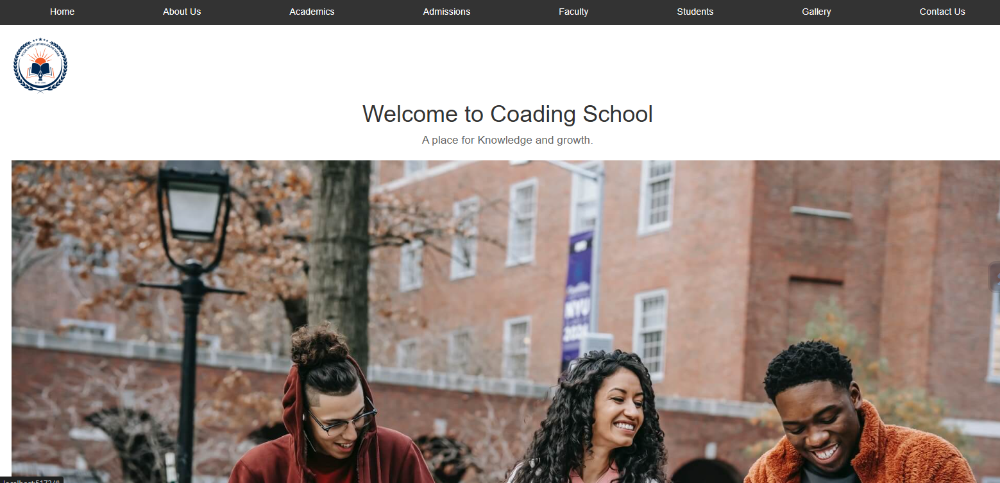

# School Website

Welcome to the School website project. This is a React-based web application for showcasing the school's information, events, and contact details.

## Table of Contents

- [Project Description](#project-description)
- [Installation](#installation)
- [Usage](#usage)
- [Components](#components)
- [Screenshots](#screenshots)
- [License](#license)

## Project Description

This project is a React web application designed for School. It includes a homepage with a carousel of events, a contact page with a form, and various other sections to provide information about the school.

## Installation

1. Clone the repository:
    ```bash
    git clone https://github.com/your-username/school-website.git
    ```

2. Navigate into the project directory:
    ```bash
    cd school-website
    ```

3. Install the dependencies:
    ```bash
    npm install
    ```

4. Start the development server:
    ```bash
    npm start
    ```

## Usage

After starting the development server, open `http://localhost:3000` in your browser to view the application. The website features:

- **Home Page**: Displays a welcome message and a carousel of events.
- **Contact Us Page**: Contains contact information and a form for users to get in touch.

## Components

### HomePage

Displays the school’s logo, a welcome message, and a carousel of events.

### ContactUs

Provides contact information and a form for users to submit inquiries.

## Screenshots

Here are some screenshots of the application:

### Home Page


### Contact Page


### About


### Gallary


## License

This project is licensed under the MIT License - see the [LICENSE](LICENSE) file for details.

---
